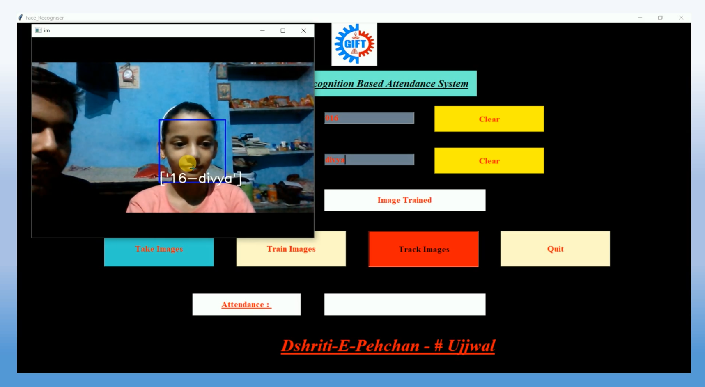

# faceRecognition

This repository contains code for facial recognition using openCV and python with a tkinter gui interface. If you want to test the code then run train.py file

## Technology used :
-openCV (Opensource Computer Vision)
-Python
-tkinter GUI interface

Here I am working on Face recognition based Attendance Management System by using OpenCV(Python). One can mark thier attendance by simply facing the camera. 

## How it works :

When we run train.py a window is opened and ask for Enter Id and Enter Name. After enter name and id then we have to click Take Images button. By clicking Take Images camera of running computer is opened and it start taking image sample of person.This Id and Name is stored in folder StudentDetails and file name is StudentDetails.csv. It takes 60 images as sample and store them in folder TrainingImage.After completion it notify that iamges saved.
After taking image sample we have to click Train Image button.Now it take few seconds to train machine for the images that are taken by clicking Take Image button and creates a Trainner.yml file and store in TrainingImageLabel folder.
Now all initial setups are done.
By clicking Track Image button camera of running machine is opened again. If face is recognised by system then Id and Name of person is shown on Image. Press Q(or q) for quit this window.After quitting it attendance of person will be stored in Attendance folder as csv file with name, id, date and time and it is also available in window.

## Step - 1

## Step - 2

## Step - 3

## Step - 4

## Step - 5
